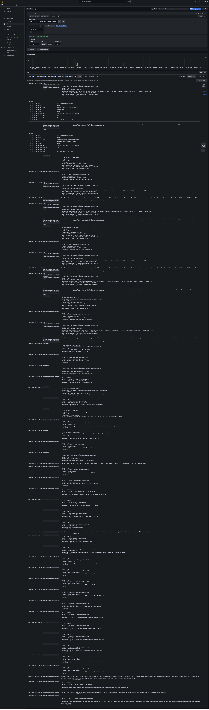

# spring-boot-web-loki-sample

### Things todo list

1. Clone this repository: `git clone https://github.com/hendisantika/spring-boot-web-loki-sample.git`
2. Navigate to the folder: `cd spring-boot-web-loki-sample`
3. Run the application: `mvn clean spring-boot:run`
4. Open your favorite browser: http://localhost:8080/swagger-ui

### Testing Logging on the Spring Boot REST App

After running the app, we can make some test calls of our REST API. In the beginning, let’s add some persons:

Add New Person

```shell
curl 'http://localhost:8080/persons' \
  -H 'Content-Type: application/json' \
  -d '{"firstName": "Itadori","lastName": "Yuji","age": 20,"gender": "MALE"}'
```

FEMALE

```shell
curl 'http://localhost:8080/persons' \
  -H 'Content-Type: application/json' \
  -d '{"firstName": "Shoko","lastName": "Ieri","age": 30,"gender": "FEMALE"}'
  
  curl 'http://localhost:8080/persons' \
  -H 'Content-Type: application/json' \
  -d '{"firstName": "Maki","lastName": "Zenin","age": 30,"gender": "FEMALE"}'
```

Get All Persons

```shell
$ curl http://localhost:8080/persons
$ curl http://localhost:8080/persons/1
$ curl http://localhost:8080/persons/2
$ curl http://localhost:8080/persons/3
```
### Image Screenshot

Swagger UI


Grafana Loki


